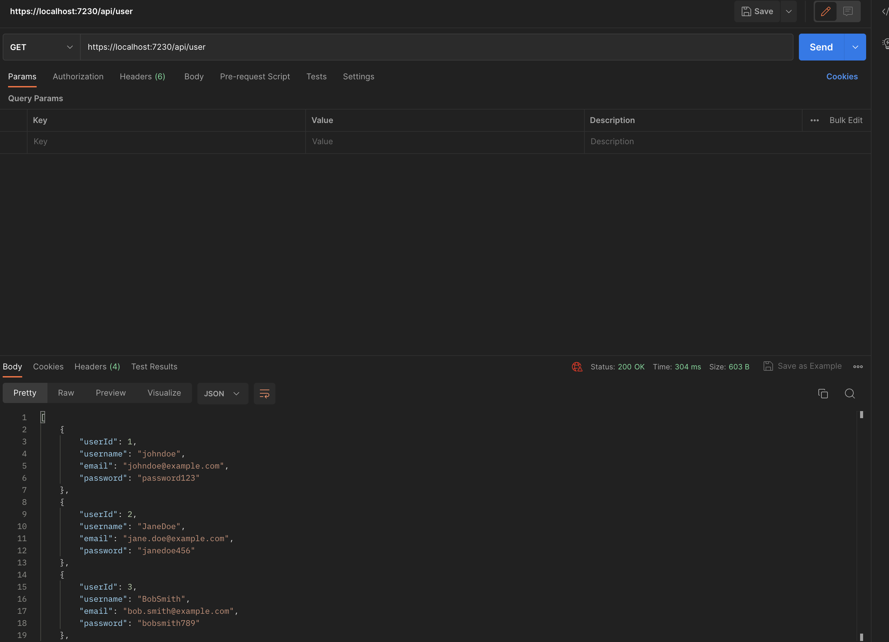

<h1 align="center">Car Inventory API</h1>

<p align="center">
  
  
</p>

## Description
The car dealership inventory API is a system designed to streamline the management of cars for sale. With this API, users can easily view and manage the inventory of cars, including retrieving key information such as make, model, year, and price. This idea was born out of a passion for cars and a desire to improve the car-buying experience for everyone.


## Pre-Requisites
- a basic understanding of the Rust programming languagw
- A database management system such as MYSQL
- A REST client such as Postman to test the API endpoints

# Installation
In order to replicate the project on your machine:
1. Clone the repository
2. Use an IDE such as Visual Studio
3. Manage nuget packages
4. Build the solution

# Implementation
The different enpoints a user can interact with are the following:

- GET /users - returns all the users stored in the database
- POST /users - creates a new user within the database
- GET /users/{id} - returns a user by their ID
- PUT /users/{id} - updates a user based on their ID
- DELETE /users/{id} - deletes a user based on thier ID
- GET /cars - retrieves the inventory of cars within the database
- POST /cars - adds a new car in the database 
- GET /cars/{id} - returns a specific car based on the ID
- PUT /cars/{id} - updates a car by its ID
- DELETE /cars/{id} - deletes a car by its ID


An example of retrieving a user from the CarInventory DB is with a GET request;

A GET method to http://localhost:7230/user/1 will display the following JSON body:
```rust
{
"userId":1,
"username":"johndoe",
"email":"johndoe@example.com",
"password":"password123"
}
```
##Contributions
If you want to make contributions to this project you can do the following:

1. Fork this repo and commit your changes to a feature branch
2. Push the changes to the feature branch
3. Create a pull request

## Demo

The screenshots below show the the different requests look like:




